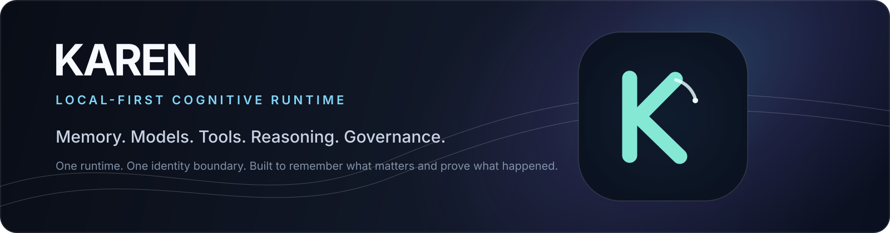

# KAREN

**Local-first cognitive runtime for governed AI, durable memory, model orchestration, reasoning, automation, extensions, and observable execution.**

KAREN is built around a simple product promise: intelligence should be useful without turning the system into a black box. Runtime authority, memory, models, tools, policy, identity, and evidence stay explicit, inspectable, and testable.

> **Memory. Models. Tools. Reasoning. Governance.** One runtime. One identity boundary.

## Why KAREN

KAREN is not a thin chat shell and it is not a collection of disconnected AI frameworks. It is a local-first operating substrate for applications that need continuity, controlled action, model/provider flexibility, durable memory, and real execution provenance.

The name intentionally flips the viral "Karen" archetype without building the product around a joke. The brand turns noise into composure, demands into governed authority, and public chaos into private, auditable intelligence. The visual system is designed to remain recognizable after the meme has faded.

## Product experience

KAREN's primary product surfaces include:

- **Governed chat runtime** with provider/model provenance, degradation truth, memory participation, and observable execution.
- **Durable memory** across short-term, episodic, and long-term layers with governed formation and recall.
- **Agents & workflows** for real multi-step execution without turning every chat into a graph workflow.
- **Comms Center** for connected communication workflows.
- **Extension ecosystem** with manifests, permissions, validation, runtime policy, and execution gates.
- **Application/runtime settings** driven by backend truth rather than UI-invented availability.

### Real product photography only

KAREN does not use generated UI mockups as product evidence. The repository includes a dedicated Playwright presentation rail that signs into a real running installation and captures the live product at an exact Git revision.

```bash
cd src/ui_launchers/Karen-AI-Theme
KAREN_CAPTURE_EMAIL='owner@example.com' \
KAREN_CAPTURE_PASSWORD='...' \
KAREN_BASE_URL='http://localhost:8010' \
npm run capture:presentation
```

The capture writes provenance-backed images and `docs/assets/screenshots/capture-manifest.json`. Generated interfaces, mocked API states, fixture-only providers, and fake conversations are forbidden in README/release screenshots.

See [`docs/BRAND_PRESENTATION.md`](docs/BRAND_PRESENTATION.md) for the brand system, screenshot rules, capture set, and presentation contract.

## Architecture

KAREN follows one authority chain instead of parallel runtimes:

```text
Intelligence
     |
Personalization ----+
Adaptive -----------+--> CORTEX --> RuntimePolicy --> ChatRuntime
                                              |
                                              +--> Direct model execution
                                              +--> Reasoning
                                              +--> LangGraph workflows
                                              +--> Agent Medusa
                                              +--> Tools / Extensions
```

The six-layer model is:

```text
1. Intelligence         senses   -> What is this request?
2. Decision             decides  -> What should KAREN do?
3. Execution            acts     -> Execute the authorized decision
4. Specialist Engines   serve    -> Models, reasoning, agents, tools, workflows
5. State                retains  -> Memory, recall, persistence, governance
6. Platform Kernel      governs  -> Security, observability, config, infrastructure
```

### Runtime authority

`src/ai_karen_engine/core/runtime/` owns live chat execution: request normalization, execution context, memory coordination, policy consumption, provider/model execution, streaming, persistence coordination, degradation metadata, telemetry, and audit lifecycle.

API routes stay thin. CORTEX decides. RuntimePolicy authorizes. Runtime executes.

### Memory

KAREN separates memory responsibilities:

- **STM** for recent conversation/session state;
- **Episodic** for meaningful interactions, decisions, and outcomes;
- **LTM** for durable facts, preferences, and knowledge;
- **NeuroRecall** for retrieval strategy and ranking;
- **MemoryFormation + NeuroVault** for governed mutation, lifecycle, recovery, and deletion.

PostgreSQL with pgvector and PostgreSQL full-text search is the canonical durable memory/data spine. Neo4j, Milvus, Elasticsearch memory projections, DuckDB, and other retired authorities are not part of the canonical current architecture.

### Providers and models

The canonical model runtime/provider registry owns availability, health, model selection, execution, and fallback. Optional local inference paths include Transformers/Hugging Face assets, Ollama, vLLM through an OpenAI-compatible path, and local GGUF serving where configured.

No route, UI component, agent, pack, or extension chooses providers independently.

### Extensions

The governed extension path is:

```text
manifest
 -> validation
 -> registry
 -> lifecycle
 -> RuntimePolicy authorization
 -> ActionExecutionGate
 -> execution
 -> output validation
 -> audit / telemetry
```

Manifest declaration is not authorization.

## First run is a production contract

A fresh KAREN installation is not considered bootstrapped because a welcome screen appeared. The production first-run path proves:

- migration-owned auth schema is ready;
- a durable installation tenant exists;
- exactly one first owner can be created;
- bootstrap cannot be re-entered after completion;
- authenticated identity works through the canonical auth service;
- state survives process restart.

The executable proof is owned by:

```text
scripts/ci/production-first-boot-smoke.sh
.github/workflows/production-first-boot-smoke.yml
```

See [`docs/architecture/FIRST_RUN_SYSTEM.md`](docs/architecture/FIRST_RUN_SYSTEM.md) for the full contract.

## Quick start

### Requirements

- Python 3.10+
- Docker with Docker Compose
- Optional NVIDIA GPU for CUDA/vLLM workflows

### 1. Clone and configure

```bash
git clone https://github.com/agustealo/AI-Karen.git
cd AI-Karen
cp .env.example .env
```

Review `.env` before startup. Replace production secrets and never commit real credentials.

### 2. Start the stack

Core stack:

```bash
docker compose up
```

CPU overlay:

```bash
docker compose -f docker-compose.yml -f deploy/compose/docker-compose.cpu.yml up
```

CUDA overlay:

```bash
docker compose -f docker-compose.yml -f deploy/compose/docker-compose.cuda.yml up
```

### 3. Verify liveness and auth readiness

```bash
curl http://localhost:8000/health/live
curl http://localhost:8000/api/auth/health
curl http://localhost:8000/api/auth/first-run
```

A fresh install should report:

```json
{
  "first_run_required": true,
  "message": "First-run setup required"
}
```

### 4. Create the first owner

```bash
curl -X POST http://localhost:8000/api/auth/first-run/setup \
  -H "Content-Type: application/json" \
  -d '{
    "email": "you@example.com",
    "full_name": "Your Name",
    "password": "Choose-A-Strong-Pass9!",
    "confirm_password": "Choose-A-Strong-Pass9!"
  }'
```

### 5. Open KAREN

```text
http://localhost:8010
```

After login, verify at least one intended provider/model path is healthy and run a real chat through the canonical `/api/chat` runtime.

## Security and observability

KAREN keeps privileged authority in the backend. Protected paths preserve authentication/session validation, RBAC, tenant isolation, least privilege, secret redaction, extension/tool permission gates, audit logging, safe error translation, and request/correlation identity.

Runtime telemetry should make it possible to determine what actually happened: request/correlation scope, tenant/user/session/conversation identity, intent/topology, provider/model/runtime engine, fallback/degradation, memory/extension/agent participation, latency, status, and error reason.

Prometheus is the canonical numeric metrics backend. High-cardinality identity belongs in structured events/traces, not metric labels.

## Verification

Backend/core gates:

```bash
python -m compileall src
pytest tests/ -q
ruff check src tests
mypy src
docker compose config
```

Frontend gates:

```bash
cd src/ui_launchers/Karen-AI-Theme
npm run typecheck
npm test
npm run build
npm run ci:forbid-mocks
```

Presentation proof:

```bash
npm run capture:presentation
```

Do not report a release or presentation path green unless the exact-head proof actually passed.

## Repository map

```text
AI-Karen/
├── src/
│   ├── ai_karen_engine/
│   │   ├── core/
│   │   ├── agent_medusa/
│   │   ├── api_routes/
│   │   ├── config/
│   │   ├── services/
│   │   └── platform/
│   └── ui_launchers/
│       └── Karen-AI-Theme/
├── tests/
├── docs/
├── scripts/
├── deploy/
├── supabase/
├── PROJECT_DEV_MANIFEST.md
└── README.md
```

## Developer truth

Read these before changing architecture:

- [`PROJECT_DEV_MANIFEST.md`](PROJECT_DEV_MANIFEST.md) for the canonical developer contract and live technology inventory;
- [`docs/development/ARCHITECTURE_AUTHORITY.md`](docs/development/ARCHITECTURE_AUTHORITY.md) for authority rules;
- [`src/ai_karen_engine/core/ARCHITECTURE.md`](src/ai_karen_engine/core/ARCHITECTURE.md) for core boundaries;
- [`src/ai_karen_engine/config/README.md`](src/ai_karen_engine/config/README.md) for configuration ownership;
- [`docs/BRAND_PRESENTATION.md`](docs/BRAND_PRESENTATION.md) for identity and product-photography rules.

Historical sprint sheets are implementation history, not architecture authority.

## License

See the repository license files for licensing terms.
