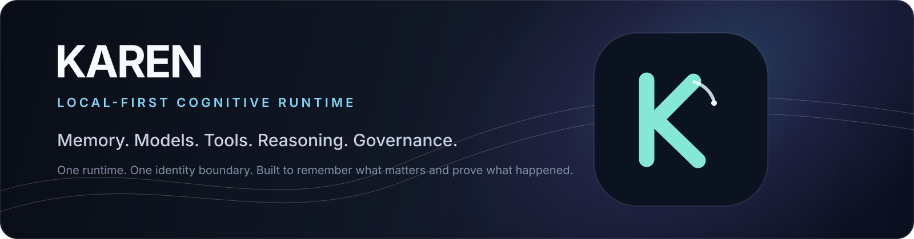
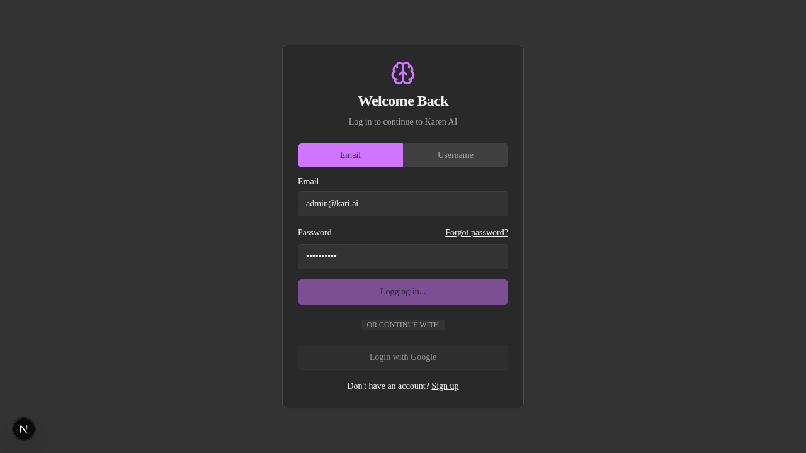

<p align="center">
  
</p>

<p align="center">
  <strong>Local-first · Prompt-first · Runtime-authoritative · Governed memory · Provider orchestration · RBAC · Observable execution</strong>
</p>

# KAREN

KAREN is a local-first, prompt-first AI runtime for governed chat execution, durable memory, provider/model orchestration, agents, workflows, extensions, and observable automation.

It is built around a simple rule: **one responsibility → one owner → one runtime path → executable proof.** KAREN is not a pile of interchangeable AI frameworks. The system separates cognition, authorization, execution, state, infrastructure, and presentation so each can evolve without becoming a second authority.

> **Local by default. Governed by design.**

## Why the name works

The familiar "Karen" meme is about escalation and asking for the manager. KAREN flips that idea without turning the product into a joke: it is the composed systems operator that knows who owns the responsibility, routes work to the correct authority, applies policy, and preserves execution truth.

The canonical identity is deliberately abstract. There is no literal meme face or novelty mascot. The K-shaped mark encodes a stable runtime spine, routed branches, and a governed handoff node. The subtle arc is the only wink to the cultural reference, keeping the identity recognizable without dating it to the meme cycle.

- [Brand system](docs/presentation/BRAND_SYSTEM.md)
- [Product presentation manifest](docs/presentation/PRODUCT_PRESENTATION_MANIFEST.md)
- [Screenshot provenance and capture contract](docs/assets/screenshots/README.md)

## Core principles

- **Local-first:** prefer healthy local inference and local infrastructure when suitable.
- **Prompt-first:** prompts are explicit, versioned, testable execution contracts rather than scattered string construction.
- **Runtime-authoritative:** routes, UI, providers, agents, and extensions do not become alternate chat runtimes.
- **CORTEX decides, Runtime executes:** cognitive classification, routing, and policy recommendations remain separate from execution.
- **RuntimePolicy authorizes:** decision components do not authorize their own actions.
- **One responsibility, one owner:** duplicate orchestrators, registries, loaders, persistence paths, and fallbacks are collapsed into canonical owners.
- **Secure by enforcement:** RBAC, tenant isolation, session validation, audit, secret handling, and action permissions are backend responsibilities.
- **Observable by default:** provider, model, memory, reasoning, agent, extension, fallback, and degradation paths should be traceable.
- **Honest degradation:** unavailable capability returns explicit degraded or unavailable state rather than fabricated model output or UI truth.
- **Test-proven architecture:** routing, fallbacks, memory, RBAC, first-run, API contracts, UI contracts, and deployment paths require executable proof.

## Product surfaces

The current web application exposes real product surfaces rather than marketing-only mockups:

| Surface | What it represents |
|---|---|
| **Chat** | Canonical conversation runtime and model execution path |
| **Comms Center** | Communication-oriented workspace inside the authenticated application |
| **Agents Overview** | Governed agent and workflow visibility |
| **Agents / Tasks / Jobs / Cron Jobs** | Operational workflow surfaces backed by application runtime state |
| **Plugin Overview** | Governed extension/plugin surface |
| **Application Settings** | User-facing configuration that must reflect backend truth |
| **My Account** | Authenticated identity/account surface |

### Real screenshots only

KAREN does not use generated dashboards or design mockups as product evidence. A dedicated Playwright showcase rail captures the real authenticated UI against a real running stack and writes the canonical gallery to `docs/assets/screenshots/`.

```bash
cd src/ui_launchers/Karen-AI-Theme

KAREN_SHOWCASE_ALLOW_CAPTURE=true \
KAREN_SHOWCASE_ACCOUNT_KIND=sanitized-demo \
KAREN_SHOWCASE_EMAIL='<sanitized-demo-email>' \
KAREN_SHOWCASE_PASSWORD='<sanitized-demo-password>' \
KAREN_SHOWCASE_TARGET_REVISION='<full-40-character-deployed-sha>' \
KAREN_SHOWCASE_BASE_URL='http://localhost:8010' \
npm run showcase:capture
```

The capture rail is intentionally fail-closed. It records the capture-harness checkout separately from the operator-attested deployed revision, and it will not silently substitute fake media when a real sanitized environment is unavailable.

<details>
<summary><strong>Existing real-browser E2E image provenance</strong></summary>

<br />



This PNG is copied byte-for-byte from the repository's committed Playwright report. It proves real browser media exists in project history, but it is deliberately treated as uncurated evidence rather than a premium marketing hero.

</details>

## Canonical architecture

KAREN's core follows a six-layer model:

```text
1. Intelligence         senses   -> What is this request?
2. Decision             decides  -> What should KAREN do?
3. Execution            acts     -> Execute the authorized decision
4. Specialist Engines   serve    -> Models, reasoning, agents, tools, workflows
5. State                retains  -> Memory, recall, persistence, governance
6. Platform Kernel      governs  -> Security, observability, config, infrastructure
```

The authority chain is approximately:

```text
Intelligence
     |
Personalization ----+
Adaptive -----------+--> CORTEX --> RuntimePolicy --> ChatRuntime
                                              |
                                              +--> Direct model execution
                                              +--> Reasoning
                                              +--> LangGraph workflows
                                              +--> Agent Medusa
                                              +--> Tools / Extensions
```

### CORTEX

`src/ai_karen_engine/core/cortex/` is the cognitive decision authority. It interprets intent, capability requirements, topology, reasoning needs, memory-routing signals, ambiguity, and execution recommendations. It does **not** execute providers, tools, plugins, memory writes, or agents.

### Chat Runtime

`src/ai_karen_engine/core/runtime/` is the live request/execution authority. It owns request normalization, execution context, memory coordination, prompt/context handoff, policy consumption, provider/model execution, streaming, persistence coordination, degradation metadata, telemetry, and audit lifecycle.

API routes stay thin.

### Model Runtime

Provider and model availability, health, inventory, selection, execution, and fallback belong to the canonical model-runtime/provider registry. The UI displays backend truth rather than inventing model availability.

Local-first fallback remains policy/config driven. No fallback may silently manufacture a model answer.

### Agent Medusa and LangGraph

Agent Medusa is a governed multi-agent execution topology, not a second runtime or policy engine.

LangGraph is reserved for real graph semantics such as branching plans, checkpoint/resume, long-running workflows, human gates, and stateful tool chains. Ordinary chat does not require LangGraph.

## Memory

KAREN separates memory responsibilities:

- **STM:** recent conversation/session state.
- **Episodic:** meaningful interactions, decisions, and outcomes.
- **LTM:** durable facts, preferences, and knowledge.
- **NeuroRecall:** retrieval strategy, ranking, and recall signals.
- **MemoryFormation + NeuroVault:** governed durable mutation, lifecycle, recovery, and deletion semantics.

Memory access and persistence remain tenant-aware, policy-governed, and auditable.

## Extensions

The canonical extension path is governed:

```text
manifest
 -> validation
 -> registry
 -> lifecycle
 -> RuntimePolicy authorization
 -> ActionExecutionGate
 -> execution
 -> output validation
 -> audit / telemetry
```

Manifest declaration is not authorization.

## First run is a production contract

A fresh installation is only correctly bootstrapped when the migration-owned auth schema is ready, a durable installation tenant exists, exactly one first owner can be created through the canonical auth authority, bootstrap cannot be re-entered after completion, authenticated identity works, and that state survives process restart.

Canonical ownership is:

```text
migrations/deployment tooling
  -> create/upgrade schema

AuthService.initialize
  -> validate auth config
  -> verify migration-owned auth tables

GET /api/auth/first-run
  -> AuthService.is_first_run()

POST /api/auth/first-run/setup
  -> transaction advisory lock
  -> re-check durable user count
  -> create/resolve durable installation tenant
  -> create verified admin + user owner
  -> audit
  -> normal authentication/session issuance
```

The auth route does not create tenant/user records directly. The UI must not infer first-run state from local storage or failed login attempts. Production runtime does not create missing auth tables as a convenience fallback.

The executable production proof is:

```text
scripts/ci/production-first-boot-smoke.sh
.github/workflows/production-first-boot-smoke.yml
```

The production smoke starts fresh PostgreSQL/pgvector and password-protected Redis, applies canonical migrations, boots the real production image, creates the first owner, proves duplicate setup is denied, verifies durable bootstrap state, restarts the exact image, and proves the owner plus completed first-run state survive restart.

See `docs/architecture/FIRST_RUN_SYSTEM.md` for the full authority, security, UI, observability, and proof contract.

## Repository layout

Canonical application code lives under `src/`.

```text
AI-Karen/
├── src/
│   ├── ai_karen_engine/
│   │   ├── core/
│   │   │   ├── cortex/
│   │   │   ├── intelligence/
│   │   │   ├── runtime/
│   │   │   ├── model_runtime/
│   │   │   ├── reasoning/
│   │   │   ├── memory/
│   │   │   └── personalization/
│   │   ├── agent_medusa/
│   │   ├── api_routes/
│   │   ├── config/
│   │   └── platform/
│   └── ui_launchers/
│       └── Karen-AI-Theme/
├── tests/
├── docs/
├── scripts/
├── deploy/
├── config_assets/
├── PROJECT_DEV_MANIFEST.md
└── README.md
```

## Quick start

### Requirements

- Python 3.10+
- Docker with Docker Compose
- Optional NVIDIA GPU for CUDA/vLLM workflows

### 1. Clone and configure

```bash
git clone https://github.com/agustealo/AI-Karen.git
cd AI-Karen
cp .env.example .env
```

Review `.env` before startup. Replace production secrets and never commit real credentials.

### 2. Start the stack

Core stack:

```bash
docker compose up
```

CPU overlay:

```bash
docker compose -f docker-compose.yml -f deploy/compose/docker-compose.cpu.yml up
```

CUDA overlay:

```bash
docker compose -f docker-compose.yml -f deploy/compose/docker-compose.cuda.yml up
```

Optional services are enabled through their Compose profiles when required by the deployment.

### 3. Verify liveness and auth readiness

```bash
curl http://localhost:8000/health/live
curl http://localhost:8000/api/auth/health
```

If auth readiness fails, fix configuration/database/migration state before trying to bootstrap an owner. First run is fail-closed.

### 4. Check first-run state

```bash
curl http://localhost:8000/api/auth/first-run
```

A fresh installation should return:

```json
{
  "first_run_required": true,
  "message": "First-run setup required"
}
```

### 5. Create the first owner

```bash
curl -X POST http://localhost:8000/api/auth/first-run/setup \
  -H "Content-Type: application/json" \
  -d '{
    "email": "you@example.com",
    "full_name": "Your Name",
    "password": "Choose-A-Strong-Pass9!",
    "confirm_password": "Choose-A-Strong-Pass9!"
  }'
```

The canonical auth service creates the installation tenant and verified first owner, then authenticates through the normal session path. Bootstrap is transaction-serialized across workers. Once durable user state exists, later first-run setup attempts are rejected.

### 6. Open the UI

```text
http://localhost:8010
```

Log in with the identity created during first run.

### 7. Verify installation readiness after login

Identity bootstrap does not take ownership of unrelated subsystems. Verify backend truth for the capabilities your deployment requires:

1. **Provider availability:** at least one intended provider is enabled and healthy.
2. **Model configuration:** the intended local/default model is discoverable and eligible through the canonical model control plane.
3. **Memory services:** durable memory dependencies are healthy when enabled.
4. **Extensions:** only governed, validated extensions required for the deployment are enabled.
5. **Observability:** metrics, logs, and tracing required by the environment are reachable.
6. **Secrets and security:** production JWT, database, Redis, extension, provider, and dashboard secrets are non-example values.
7. **First real chat:** submit a request through the canonical chat runtime and verify response provenance/degradation metadata reflects the provider/model that actually executed.

A typed installation-readiness view may aggregate these subsystem signals, but it must not become a second provider, memory, extension, or observability authority.

## Production deployment

Production uses the validated production environment file and Compose overlay:

```bash
cp .env.production.example .env.production
# Replace all CHANGE_ME/example values and choose the real public HTTP/HTTPS scheme.

docker compose \
  --env-file .env.production \
  -f docker-compose.yml \
  -f deploy/compose/docker-compose.prod.yml \
  config

docker compose \
  --env-file .env.production \
  -f docker-compose.yml \
  -f deploy/compose/docker-compose.prod.yml \
  up -d
```

Production/staging authentication validates configuration and fails closed. Canonical migrations remain authoritative for production schema, and the API must not invent missing tables or bootstrap state at runtime.

## Default development endpoints

| Service | Address |
|---|---|
| Web UI | http://localhost:8010 |
| API | http://localhost:8000 |
| OpenAPI | http://localhost:8000/docs |
| Metrics | http://localhost:8000/metrics |
| Prometheus | http://localhost:9090 |
| Grafana | http://localhost:3001 |

Optional services are available only when their corresponding profiles are enabled.

## Configuration

Canonical application configuration lives under:

```text
src/ai_karen_engine/config/
```

Environment-specific values and secrets enter through validated configuration adapters and deployment files. Subsystems should not scatter direct environment reads when a canonical configuration contract already exists. Remaining configuration-convergence debt belongs in `PROJECT_DEV_MANIFEST.md`, not in parallel helpers or UI fallbacks.

## Security

KAREN's protected execution paths preserve authentication/session validation, RBAC, durable tenant isolation, least privilege, secret redaction, extension permission gates, audit logging, safe error translation, request/correlation identity, and fail-closed production behavior.

Frontend checks are presentation only. Privileged authority is backend-owned.

## Observability

Runtime events should make it possible to determine what actually happened, including request/correlation identity, tenant/user/session/conversation scope, intent/topology, provider/model/runtime engine, fallback/degradation, memory/extension/agent participation, latency, status, and error reason.

Prometheus is the canonical numeric metrics backend. High-cardinality request/user identifiers belong in structured logs/traces rather than Prometheus labels.

## Verification

The live merge contract is encoded in `.github/workflows/main-quality-gate.yml` and the focused authority workflows. The workflow files, not README prose, are the source of truth for the exact gate set.

The current Main Quality frontend job runs these checks from `src/ui_launchers/Karen-AI-Theme`:

```bash
npm ci --no-audit --no-fund
npm run ci:forbid-mocks
npm run typecheck
node --check server.mjs
npx vitest run --passWithNoTests
npm run build
```

The current backend quality job compiles production Python, runs the correctness-focused Ruff baseline, type-checks the canonical authority contracts, then executes the architecture/runtime/classifier/chat/personalization/memory/tenant proof suites. See the workflow for the exact file and test list.

Useful broad local audits remain:

```bash
python -m compileall src
pytest tests/ -q
ruff check src tests
mypy src
docker compose config
```

Those broad commands intentionally surface repository-wide debt beyond the narrower merge-gate baseline. Do not replace an exact-head workflow verdict with a partial local run, and do not describe a broad audit as green unless it actually passed.

First-run architecture contract:

```bash
pytest tests/architecture/test_first_run_system_contract.py -q
bash -n scripts/ci/production-first-boot-smoke.sh
```

Real production first-run burn:

```bash
docker build --target app --build-arg PROFILE=runtime -t ai-karen-api:beta .
KAREN_SMOKE_API_IMAGE=ai-karen-api:beta bash scripts/ci/production-first-boot-smoke.sh
```

Do not report a release path green unless the exact-head CI/proof actually passed.

## Development rules

Before adding or changing a service, registry, orchestrator, helper, route, provider, configuration path, setup flow, or fallback:

1. Identify the current owner of the responsibility.
2. Search for a stronger existing implementation before creating another one.
3. Extend or merge into the canonical owner rather than preserving a parallel path.
4. Preserve RBAC, tenant scope, audit, credential handling, correlation identity, and telemetry.
5. Keep API routes thin and orchestration in the runtime/service owner.
6. Keep provider/model decisions out of the UI. The UI renders backend truth.
7. Keep CORTEX decision-only and Runtime execution-authoritative.
8. Keep schema creation and evolution migration-owned in production.
9. Prefer central config/registry contracts over scattered hardcoded values.
10. Prove the boundary with executable tests, burns, and exact-head CI.
11. Delete dead or duplicate code only after reference audit and replacement proof.

## Architecture documentation

Read these first:

- `PROJECT_DEV_MANIFEST.md` for the canonical developer contract and live truth map.
- `docs/architecture/FIRST_RUN_SYSTEM.md` for installation/bootstrap authority and proof.
- `docs/development/ARCHITECTURE_AUTHORITY.md` for architectural ownership rules.
- `src/ai_karen_engine/core/ARCHITECTURE.md` for core authority boundaries.
- `src/ai_karen_engine/core/README.md` for core-domain ownership.
- `src/ai_karen_engine/config/README.md` for configuration ownership.
- `docs/presentation/BRAND_SYSTEM.md` for visual identity.
- `docs/presentation/PRODUCT_PRESENTATION_MANIFEST.md` for public presentation truth.

Historical sprint sheets are implementation history, not architecture authority.

## License

See the repository license files for licensing terms.
