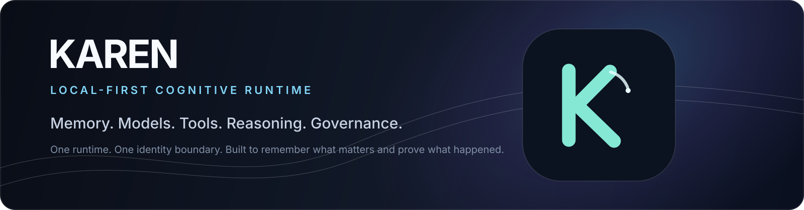
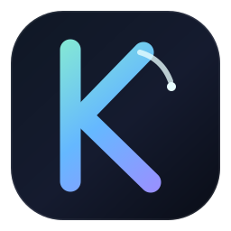
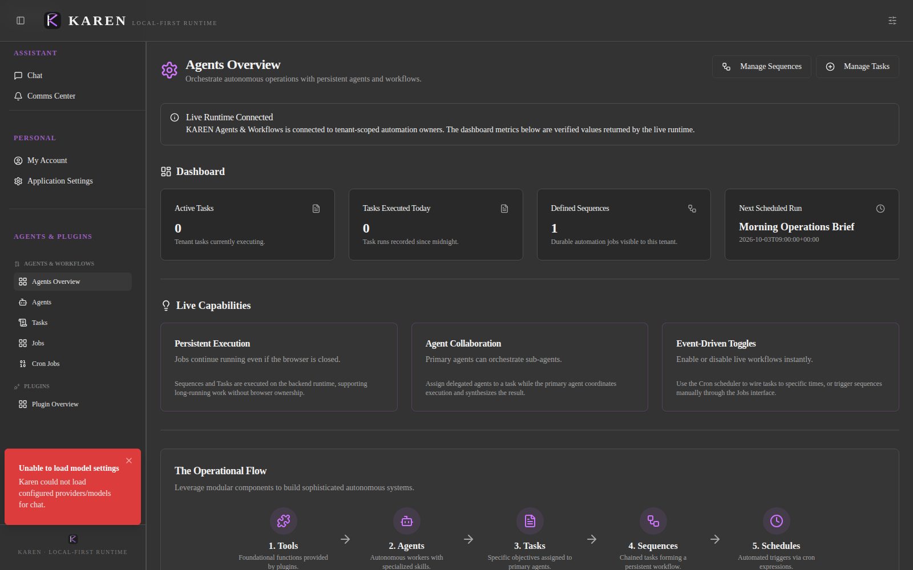
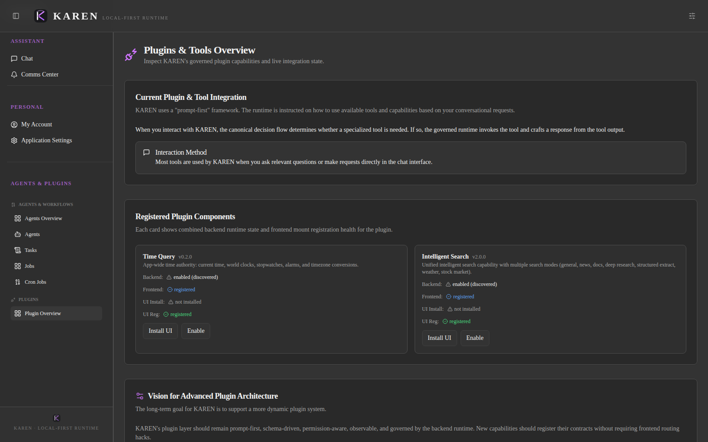
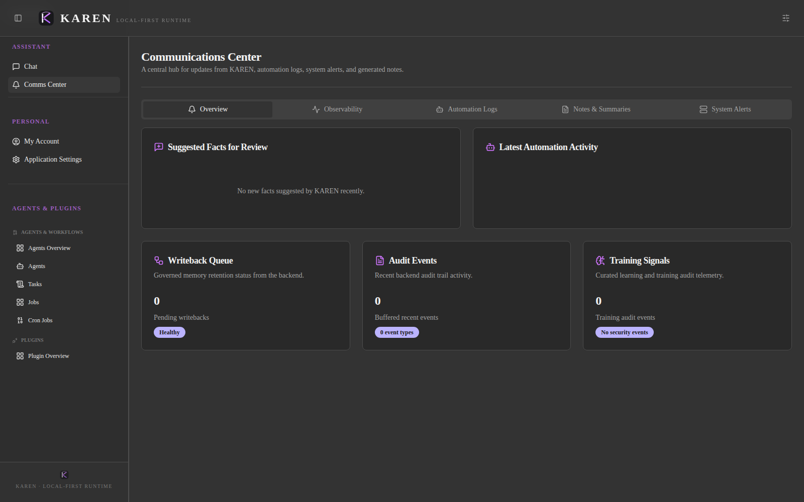

<p align="center">
  
</p>

<p align="center">
  
</p>

<h1 align="center">KAREN</h1>

<p align="center">
  <strong>Your local-first AI workspace for chat, memory, agents, automations, plugins, and model control.</strong>
</p>

<p align="center">
  Local by default · Governed by design · Durable memory · Real tool use · Observable execution
</p>

---

KAREN is an AI application and runtime designed to feel useful to a person first, while keeping the hard engineering boundaries underneath it explicit.

Ask KAREN a question, use live capabilities such as search and time, work across durable conversations, manage local and external models, run governed agents and automations, connect extensions, and inspect what actually happened when a request executed.

The product follows one rule throughout the stack:

> **One responsibility → one owner → one runtime path → executable proof.**

That means the UI does not invent provider health, model availability, memory state, plugin state, or successful execution. KAREN projects backend truth and degrades honestly when a capability is unavailable.

## See KAREN

The images below are **real browser captures of the real authenticated application** from a sanitized demo installation. They are not generated dashboards or hand-built mockups.

<table>
  <tr>
    <td width="50%">
      
      <br />
      <strong>Agents overview</strong>
    </td>
    <td width="50%">
      
      <br />
      <strong>Plugin ecosystem</strong>
    </td>
  </tr>
</table>

<p align="center">
  
  <br />
  <strong>Comms Center</strong>
</p>

> **Screenshot provenance:** these previews come from the governed October 2, 2026 capture at target revision `9980fb0bbcf52d162c53278d759c6632dc416a24` using a sanitized demo account. Two images from that historical five-screen capture currently show failed/loading state and are deliberately **not promoted here**. The application has also evolved since that capture, so a fresh governed five-screen capture is still required before consumer-release visual signoff. See [screenshot provenance](docs/assets/screenshots/README.md).

## What you can do with KAREN

### Talk to an assistant that can actually use the system

The Chat surface runs through KAREN's canonical execution runtime. A request can stay simple and direct, use a live capability, invoke reasoning, enter a workflow, use a plugin/tool, or route to an eligible model without turning every message into an oversized agent graph.

KAREN exposes execution truth such as provider/model identity, degradation, memory participation, reasoning evidence, persistence state, and runtime telemetry instead of hiding everything behind a single response bubble.

### Keep useful memory without turning memory into a junk drawer

KAREN separates recent session state, episodic memory, durable long-term facts, recall, and governed memory formation.

Memory is tenant-aware, policy-governed, auditable, and designed to learn durable user context without making every past detail equally important.

### Use local models and external providers

KAREN supports a local-first provider/model control plane with model discovery, validation, installation, inventory, fallback, health, and runtime selection.

The application can work with local runtimes such as Ollama, llama.cpp, vLLM, LM Studio-compatible endpoints, Transformers-backed paths, and configured external providers where policy allows.

Model downloads are backend-governed. License/gating state, runtime compatibility, storage, and installation truth are not delegated to frontend guesses.

### Run agents and real workflows

KAREN includes governed agents, tasks, jobs, cron jobs, automation surfaces, and LangGraph-backed workflow execution where graph semantics are actually useful.

LangGraph is reserved for branching, resumable, stateful, long-running, or human-gated work. Ordinary chat remains ordinary chat.

### Connect plugins and extensions

Extensions follow a governed lifecycle:

```text
manifest
 -> validation
 -> registry
 -> lifecycle
 -> RuntimePolicy authorization
 -> ActionExecutionGate
 -> execution
 -> output validation
 -> audit / telemetry
```

A plugin declaring a capability does not automatically receive permission to use it.

### Know when something failed

KAREN is intentionally allergic to showroom cardboard.

Unavailable providers, failed memory persistence, missing model metadata, plugin discovery failures, blocked actions, and degraded execution should surface as real state instead of being painted green in the UI.

## Product surfaces

| Surface | Purpose |
|---|---|
| **Chat** | Canonical conversation, live capability, memory, reasoning, model, and workflow execution |
| **Conversation Intelligence** | Provider/model, context, memory, reasoning, persistence, and runtime evidence |
| **Agents Overview** | Governed agent/workflow visibility |
| **Tasks / Jobs / Cron Jobs** | Operational and scheduled execution |
| **Plugin Overview** | Installed and discoverable extension lifecycle |
| **Comms Center** | Communication-oriented workspace and connected activity |
| **Application Settings** | Models, providers, downloads, policies, runtime configuration, and user-facing system state |
| **My Account** | Authenticated identity and account state |

## Quick start

### Requirements

For the normal containerized setup:

- Git
- Docker with Docker Compose v2
- Supabase CLI for the canonical local PostgreSQL stack
- A modern browser

Useful for development:

- Python 3.10+
- Node.js 20+
- NVIDIA Container Toolkit when using CUDA/vLLM paths

### 1. Clone

```bash
git clone https://github.com/agustealo/AI-Karen.git
cd AI-Karen
```

### 2. Create your environment

```bash
cp .env.example .env
```

PowerShell:

```powershell
Copy-Item .env.example .env
```

Review the resulting `.env` before startup. Replace secrets and configure only the providers/services you actually intend to use.

### 3. Start the canonical local database and apply migrations

KAREN's base Compose stack does **not** create PostgreSQL. For local development, the checked-in Supabase project owns the canonical PostgreSQL/pgvector database on port `54322`.

Start it first:

```bash
supabase start
```

For a **fresh local installation**, apply the complete migration chain:

```bash
supabase db reset
```

`supabase db reset` is destructive to the local Supabase database. Use it for a new local installation or an intentional local reset, not against a database containing data you need to preserve.

The schema authority is `supabase/migrations/`. KAREN runtime startup intentionally does not invent missing production auth/application tables.

### 4. Start KAREN

```bash
docker compose up -d
```

Then check the stack:

```bash
docker compose ps
```

The default web application is available at:

```text
http://localhost:8010
```

The API is available at:

```text
http://localhost:8000
```

### 5. Confirm the backend is ready

```bash
curl http://localhost:8000/health/live
curl http://localhost:8000/api/auth/health
curl http://localhost:8000/api/auth/first-run
```

On a fresh installation, first-run should report that setup is required.

### 6. Create the first owner

Open:

```text
http://localhost:8010
```

and complete the first-run owner flow.

The UI delegates to the canonical backend bootstrap authority. First-run state is durable backend truth, not browser-local state.

For API-driven bootstrap:

```bash
curl -X POST http://localhost:8000/api/auth/first-run/setup \
  -H "Content-Type: application/json" \
  -d '{
    "email": "admin@karen.ai",
    "full_name": "Admin User",
    "password": "!Password123",
    "confirm_password": "!Password123"
  }'
```

Replace those example credentials for any real installation.

### 7. Configure your model/provider

After signing in:

1. Open **Application Settings**.
2. Choose the intended local or external provider.
3. Confirm the backend reports the provider as healthy.
4. Discover or install an eligible model.
5. Review model license/access terms when the backend reports that acceptance is required.
6. Run a real chat.

A model appearing in the UI is not sufficient by itself. The backend model runtime remains the authority for whether that model can actually execute.

## Local runtime profiles

Normal local stack:

```bash
docker compose up -d
```

CPU-oriented overlay:

```bash
docker compose \
  -f docker-compose.yml \
  -f deploy/compose/docker-compose.cpu.yml \
  up -d
```

CUDA-oriented overlay:

```bash
docker compose \
  -f docker-compose.yml \
  -f deploy/compose/docker-compose.cuda.yml \
  up -d
```

Optional services remain configuration/profile driven. KAREN should never enable a service merely to make a screen look healthy.

## Everyday operator commands

```bash
# Start
docker compose up -d

# Status
docker compose ps

# Logs
docker compose logs -f

# Restart
docker compose restart

# Stop while preserving durable volumes
docker compose down

# Rebuild after code/dependency changes
docker compose build
docker compose up -d
```

Do not delete database, model, or application volumes as a routine troubleshooting step. Persistent state is part of the product.

## First-run readiness checklist

Before treating an installation as ready:

- [ ] API liveness is healthy.
- [ ] Authentication health is ready.
- [ ] First owner was created through the canonical first-run flow.
- [ ] First-run cannot be entered again after setup.
- [ ] Owner identity survives restart.
- [ ] Intended provider is healthy.
- [ ] Intended model is discoverable and eligible.
- [ ] PostgreSQL/pgvector-backed durable state is healthy.
- [ ] Redis-backed coordination/hot state is healthy when enabled.
- [ ] Required memory, plugin, and observability subsystems are healthy.
- [ ] A real chat succeeds through the canonical runtime.
- [ ] A second turn preserves conversation continuity.
- [ ] Logs and telemetry do not expose secrets.

## Common setup problems

### The UI loads but chat cannot answer

Check provider/model eligibility from the backend. UI reachability does not prove inference readiness.

### A local model exists but KAREN cannot reach it

Verify the provider base URL from the environment where the API is running. Inside a container, `localhost` refers to that container, not automatically to the host.

### Authentication health is not ready

Check database connectivity, migrations, required auth configuration, and secrets. Do not bypass the health contract by manually inserting users.

### First-run says setup is already complete

The connected durable database already contains a user. Confirm that KAREN is pointed at the intended database before changing data.

### A restart loses identity or conversation state

Treat that as a persistence defect. Verify PostgreSQL/Redis volumes and connection configuration instead of accepting a fresh bootstrap as normal behavior.

### A model asks for license/access acceptance

Use the model card in **Application Settings → Model Downloads** to review the source terms and explicitly accept them for the exact model/revision when required.

## How KAREN is built

KAREN separates cognitive decisions from authorization and execution:

```text
Intelligence
     |
Personalization ----+
Adaptive -----------+--> CORTEX --> RuntimePolicy --> ChatRuntime
                                              |
                                              +--> Direct model execution
                                              +--> Live capabilities
                                              +--> Reasoning
                                              +--> LangGraph workflows
                                              +--> Agent Medusa
                                              +--> Tools / Extensions
```

The six broad layers are:

```text
1. Intelligence         senses   -> What is this request?
2. Decision             decides  -> What should KAREN do?
3. Execution            acts     -> Execute the authorized decision
4. Specialist Engines   serve    -> Models, reasoning, agents, tools, workflows
5. State                retains  -> Memory, recall, persistence, governance
6. Platform Kernel      governs  -> Security, observability, config, infrastructure
```

### CORTEX decides

`src/ai_karen_engine/core/cortex/` owns cognitive classification, capability requirements, topology, reasoning recommendations, memory-routing signals, and ambiguity handling.

CORTEX does not execute providers, tools, plugins, agents, or memory writes.

### Runtime executes

`src/ai_karen_engine/core/runtime/` owns the live request lifecycle: normalized execution context, policy consumption, memory coordination, prompt/context handoff, provider/model execution, live capability execution, streaming, persistence, telemetry, and degradation.

### RuntimePolicy authorizes

Decision code does not grant itself permission. Sensitive actions remain backend-authorized through policy and execution gates.

### Memory stays layered

- **STM:** recent conversation/session state
- **Episodic:** meaningful interactions, decisions, and outcomes
- **LTM:** durable facts, preferences, and knowledge
- **NeuroRecall:** retrieval/ranking and recall signals
- **MemoryFormation + NeuroVault:** governed durable mutation, lifecycle, recovery, and deletion

### Models stay runtime-owned

Provider/model inventory, health, fallback, selection, downloads, license gating, and execution remain owned by the model runtime and its registries.

The UI renders that truth. It does not become a second model router.

## Repository layout

```text
AI-Karen/
├── src/
│   ├── ai_karen_engine/
│   │   ├── core/
│   │   │   ├── cortex/
│   │   │   ├── intelligence/
│   │   │   ├── runtime/
│   │   │   ├── model_runtime/
│   │   │   ├── reasoning/
│   │   │   ├── memory/
│   │   │   └── personalization/
│   │   ├── agent_medusa/
│   │   ├── api_routes/
│   │   ├── config/
│   │   └── platform/
│   └── ui_launchers/
│       └── Karen-AI-Theme/
├── tests/
├── docs/
├── scripts/
├── deploy/
├── config_assets/
├── PROJECT_DEV_MANIFEST.md
└── README.md
```

## Default endpoints

| Service | Address |
|---|---|
| Web UI | http://localhost:8010 |
| API | http://localhost:8000 |
| OpenAPI | http://localhost:8000/docs |
| Metrics | http://localhost:8000/metrics |
| Prometheus | http://localhost:9090 |
| Grafana | http://localhost:3001 |

Optional services are available only when their corresponding profiles are enabled.

## Verification

KAREN's merge contract lives in the repository workflows. Workflow definitions, not README prose, are the source of truth for the exact current gate set.

Useful local checks:

```bash
python -m compileall src
pytest tests/ -q
ruff check src tests
mypy src
docker compose config
```

Frontend checks from `src/ui_launchers/Karen-AI-Theme`:

```bash
npm ci --no-audit --no-fund
npm run ci:forbid-mocks
npm run typecheck
npx vitest run --passWithNoTests
npm run build
```

First-run architecture proof:

```bash
pytest tests/architecture/test_first_run_system_contract.py -q
bash -n scripts/ci/production-first-boot-smoke.sh
```

Real production first-run burn:

```bash
docker build --target app --build-arg PROFILE=runtime -t ai-karen-api:beta .
KAREN_SMOKE_API_IMAGE=ai-karen-api:beta bash scripts/ci/production-first-boot-smoke.sh
```

Do not call a release path green unless the exact-head proof actually passed.

## Screenshot capture and presentation proof

The public screenshot gallery is governed product evidence.

Local approved demo capture:

```bash
cd src/ui_launchers/Karen-AI-Theme

KAREN_SHOWCASE_ALLOW_CAPTURE=true \
KAREN_SHOWCASE_ACCOUNT_KIND=sanitized-demo \
KAREN_SHOWCASE_EMAIL='<sanitized-demo-email>' \
KAREN_SHOWCASE_PASSWORD='<sanitized-demo-password>' \
KAREN_SHOWCASE_TARGET_REVISION='<full-40-character-deployed-sha>' \
KAREN_SHOWCASE_BASE_URL='http://localhost:8010' \
npm run showcase:capture
```

Then validate:

```bash
cd ../../..
python scripts/ci/verify_presentation_assets.py --require-assets
```

The capture contract rejects fake media, fixture-only state, invalid provenance, personal/production data, partial galleries, and unapproved capture environments.

See:

- [Screenshot provenance](docs/assets/screenshots/README.md)
- [Brand system](docs/presentation/BRAND_SYSTEM.md)
- [Product presentation manifest](docs/presentation/PRODUCT_PRESENTATION_MANIFEST.md)

## Production deployment

Create the production environment:

```bash
cp .env.production.example .env.production
```

Replace every required `CHANGE_ME`, example secret, placeholder URL, database/Redis credential, provider credential, and public scheme value.

Validate the rendered Compose contract:

```bash
docker compose \
  --env-file .env.production \
  -f docker-compose.yml \
  -f deploy/compose/docker-compose.prod.yml \
  config
```

Start:

```bash
docker compose \
  --env-file .env.production \
  -f docker-compose.yml \
  -f deploy/compose/docker-compose.prod.yml \
  up -d
```

Then verify:

```text
/health/live
-> /api/auth/health
-> /api/auth/first-run
-> owner bootstrap if required
-> authenticated login
-> provider/model readiness
-> real chat
-> restart/persistence confirmation
```

Production authentication and bootstrap intentionally fail closed. Runtime convenience logic must not invent missing schemas, users, tenants, providers, model state, or successful persistence.

## Development rules

Before adding or changing a service, registry, orchestrator, route, provider, setup flow, configuration path, or fallback:

1. Identify the existing owner.
2. Search for a stronger implementation before creating another one.
3. Extend the canonical owner instead of creating a parallel authority.
4. Preserve RBAC, tenant scope, audit, credentials, correlation identity, and telemetry.
5. Keep routes thin.
6. Keep provider/model decisions out of the UI.
7. Keep CORTEX decision-only.
8. Keep Runtime execution-authoritative.
9. Keep schema creation/evolution migration-owned in production.
10. Prove the boundary with executable tests and exact-head CI.
11. Remove obsolete compatibility code only after reference audit and replacement proof.

## Documentation

Start here:

- [Project developer manifest](PROJECT_DEV_MANIFEST.md)
- [First-run system](docs/architecture/FIRST_RUN_SYSTEM.md)
- [Architecture authority](docs/development/ARCHITECTURE_AUTHORITY.md)
- [Core architecture](src/ai_karen_engine/core/ARCHITECTURE.md)
- [Core domains](src/ai_karen_engine/core/README.md)
- [Configuration ownership](src/ai_karen_engine/config/README.md)
- [Brand system](docs/presentation/BRAND_SYSTEM.md)
- [Product presentation manifest](docs/presentation/PRODUCT_PRESENTATION_MANIFEST.md)
- [Screenshot provenance](docs/assets/screenshots/README.md)

Historical sprint sheets describe implementation history. They are not architecture authority.

## License

See the repository license files for licensing terms.
